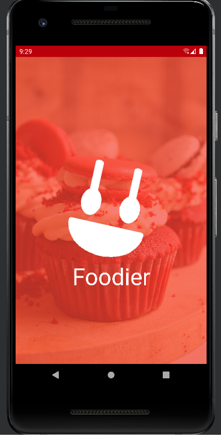
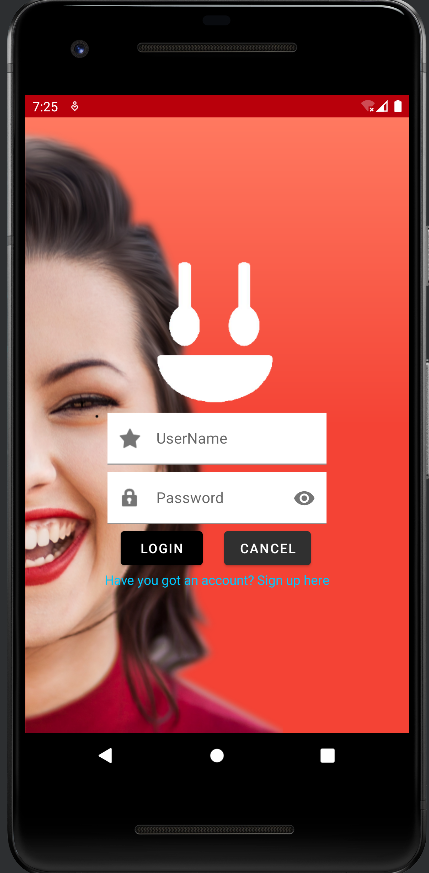
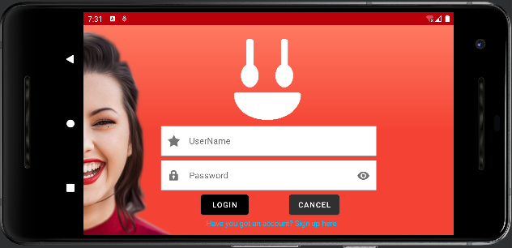
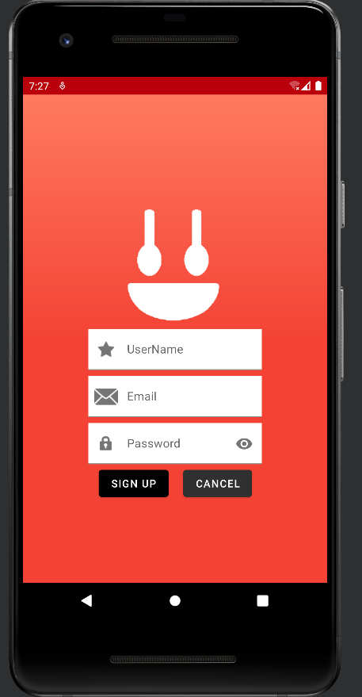
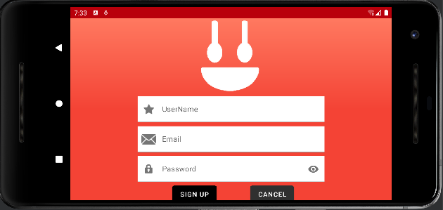
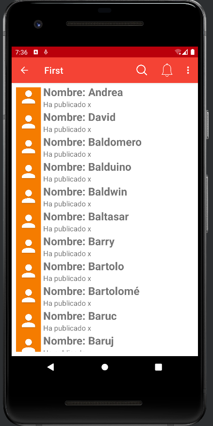
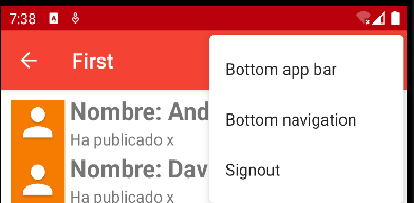
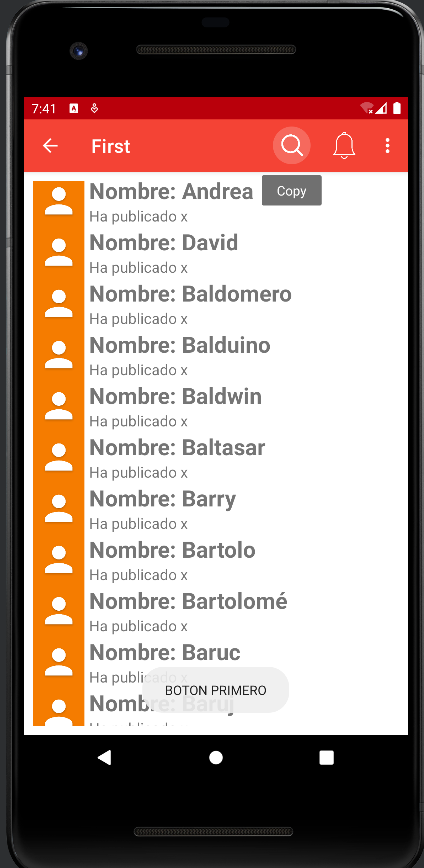
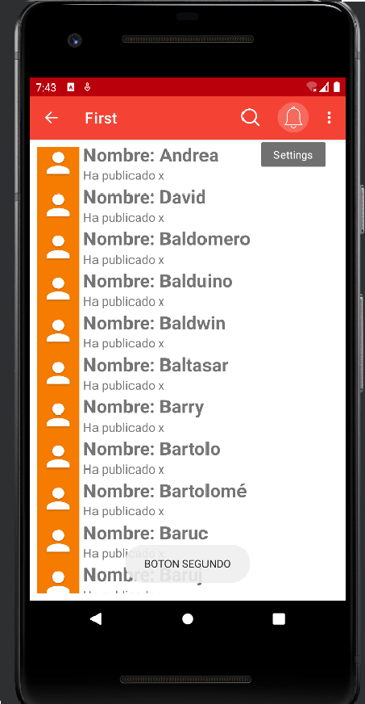
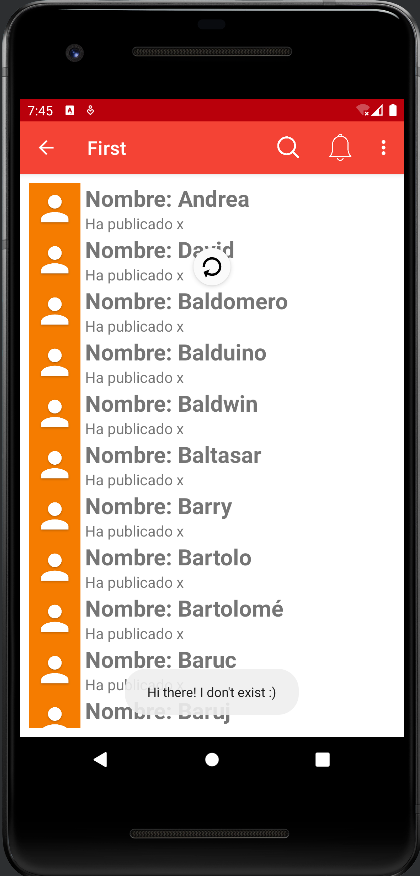

# Realización del proyecto First
Realización del proyecto first en conjunto con la aplicación realizada en figma "Foodier".

## Splash Screen - Pantalla de inicio

En la [pantalla de inicio](./app/src/main/res/layout/activity_splash.xml) podemos encontrar poca cosa, ya que es una pantalla simple, sin embargo, podemos observar que cuenta con una imgen de fondo de unos cupcakes, extraída de
[unsplash](https://unsplash.com/photos/fa59muUjyec) y con un TextView por encima el cual ocupa toda la pantalla el cual es del color principal de la aplicación con la peculiaridad
del atributo alpha para poder modificar la opacidad. A su vez también dispone del logo de la propia aplicación centrado en medio de la pantalla y justo debajo otro TextView con el
nombre de la aplicación con una "FontFamily" descargada desde el propio Android Studio, denominada [Amaranth_bold](./app/src/main/res/font/amaranth_bold.xml).

Después trasladándonos al [Proyecto Java](./app/src/main/java/com/dgarcia/first/Splash.java) podemos observar que hay varias animaciones creadas enlazadas todas con "Handler().postDelayed"
para poder añadir un delay y que no se ejecuten todas a la vez, de modo que quede un movimiento en el logo más "smooth". También la imagen de fondo sacada de [unsplash](https://unsplash.com/photos/fa59muUjyec)
se declara en este Java para optimizar recursos y seguidamente un método para que se abra la aplicación transcurridos 5 segundos.

## Ventana de Login - Inicio de sesión

En la acitividad XML del Login denominada [LoginActivity](./app/src/main/res/layout/loginactivity.xml) podemos encontrar en primera instancia que no tiene un color sólido como fondo,
sino que tiene añadido un [gradiente](./app/src/main/res/drawable/gradient.xml) con distintas tonalidades de rojos (saturadas y con mayor luminosidad). Seguidamente encontramos el logo,
y a raíz de el mismo se realizarán los distintos posicionamientos de los demás items que encontraremos. Seguidamente encontramos dos textfields que actúan como inputs para poder introducir
tanto nuestro nombre como nuestra contraseña mediante un EditText, y tienen la peculiaridad de que en la parte izquierda de estos campos contienen una imagen (en este caso predeterminada de
Android Studio) la cual se introduce gracias al atributo "startIconDrawable" en el text field. La contraseña a su vez cuenta con el atributo "passwordToggleEnabled" para poder ver lo que estamos
escribiendo de contraseña o no (ya depende del usuario). También, debido al [documento Java](./app/src/main/java/com/dgarcia/first/LoginActivity.java) encontramos de fondo la imagen de una chica
insertada mediante un Glide.

Seguidamente, nos encontramos con los botones de Login (el cual acciona el método "openMain" si se clickea) y el botón Cancelar. Y después, encontramos un TextView por si no tenemos una cuenta
creada poder acceder a la actividad [SignUp](./app/src/main/res/layout/signupactivity.xml) mediante su click. Y por último unos márgenes seguros para poder centrar los items.

Otra peculiaridad, es que también contamos con [la vista en horizontal de este layout](./app/src/main/res/layout-land/loginactivity.xml), que nos permite poder rotar la pantalla y que no se desordenen
los distintos items que contiene.

## Ventana de Sign Up - Creación de usuario

Es una [ventana](./app/src/main/res/layout/signupactivity.xml) similar a la de login anteriormente mencionada. Los cambios notables que podemos observar son un nuevo campo el cual es el del EMAIL y el botón de cancelar
para volver a la ventana de [Login](./app/src/main/res/layout/loginactivity.xml).

A su vez esta ventana también dispone de una [vista horizontal](./app/src/main/res/layout-land/signupactivity.xml), la cual tiene el mismo uso que la de login.

## Ventana de MainActivity - Actividad principal

Esta actividad denominada [MainActivity](./app/src/main/res/layout/activity_main.xml) lo único que podemos apreciar es un RecyclerView, el cual está listando items
de [itembandeja.xml](./app/src/main/res/layout/activity_main.xml) el cual se utilizará para poder simular una "feed" de una red social la cual podría ser similar
a la de Twitter. Aunque también está dentro del código la práctica de poder visualizar la web de imágenes.

Sin embargo, si observamos también su archivo Java denominado [MainActivity](./app/src/main/java/com/dgarcia/first/MainActivity.java) podemos observar que existen varias funciones, como un alert dialog en cual fue añadido
de forma adicional a la actividad para que quedara de una manera más realista a una aplicación normal, con dos botones dentro (positivo y negativo)
los cuales uno te desloguearia de la aplicación y el otro cancelaría la acción. Sin embargo, a esto se puede acceder dando a los tres botones que aparecen en la parte
superior de la pantalla los cuales están declarados en el [menu_appbar](./app/src/main/res/menu/activity_main.xml) y llamados dentro de la actividad java mediante
el onCreateOptionsMenu junto al onOptionsItemSelected para poder elegir una de las 3 opciones declaradas.

Después podemos observar un onCreateContextMenu y onContextItemSelected, el cual, la diferencia que tiene es que este agrega funcionalidades a los otros dos botones
declarados en el app bar y modificados mediante imágenes. Todos los botones los cuales no tienen acciones, lo que harán será mostrar distintos texto para identificarlos
y poder ser usados en un futuro.

Otra función que tiene es que "Refresh" el cual hace un reload y mostrará un texto.

